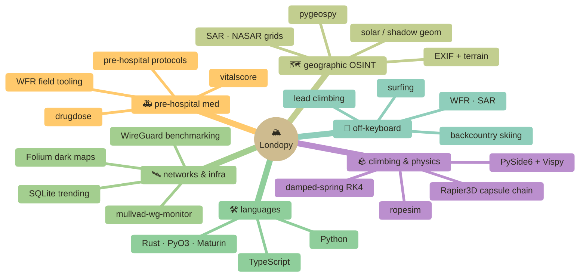

<div align="center">

[](https://git.io/typing-svg)


&nbsp;

&nbsp;


</div>

```text
        .             .              .          .                         .
   .       .       .         /\         .             .         .
                          /\/  \              .                  .
   .         .          /\/    \  .                          .         .
              .        /  \     \              .       /\
        .             /    \     \    .              /  \      .
   .            /\___/      \_____\___________   _/    \____.        .
                           ~~basecamp~~        ~~the keyboard~~
```

---

## 🏕️  basecamp · who is this

california kid, freshman in college, writes python between surf sessions and lead climbs. half the repos here started because something annoyed me on a trail or in the field — a rope question, a pre-hospital protocol, a SAR grid I had to draw on paper. so i built the tool.

i ship a lot, half the time it's libraries, half the time it's GUIs, occasionally it's a Rust core that makes the whole thing 100× faster. i don't build for a resume — i build because the problem is interesting and i want to know how it works underneath.

> currently into → climbing rope dynamics · pre-hospital med tooling · geographic OSINT · network benchmarking · cybersecurity · Nuke compositing
>
> currently outside → skiing the sierras · surfing the central coast · climbing wherever i can drive to · WFR field practice

**reach me →** discord `_Londo.`

---

## 🏔️  featured summits

> the four climbs i'm proudest of right now. all on PyPI, all MIT, all built end-to-end.

### 🪨  [ropesim](https://github.com/Londopy/ropesim) &nbsp;·&nbsp; climbing rope physics engine
[](https://pypi.org/project/ropesim/) [](https://github.com/Londopy/ropesim) [](https://github.com/Londopy/ropesim/blob/main/LICENSE)

UIAA 101 / EN 892 impact-force modelling with a damped-spring RK4 integrator written in **Rust** and exposed to Python via **PyO3 / Maturin**. Ships a 20+ command CLI, a **PySide6 desktop GUI** with a 3D Vispy viewport, optional **Rapier3D** capsule-chain rope simulation, parallel batch sweeps via Rayon, a 25-rope database (Beal · Mammut · Sterling · Petzl · Edelrid · BD), guide-mode self-locking belay device math, anchor-system load distribution, and Jupyter HTML/SVG reprs. Built because i wanted to know what *actually* happens during a factor-2 fall.

### 🛰️  [mullvad-wg-monitor](https://github.com/Londopy/mullvad-wg-monitor) &nbsp;·&nbsp; VPN benchmarking lab
[](https://github.com/Londopy/mullvad-wg-monitor) [](https://github.com/Londopy/mullvad-wg-monitor) [](https://github.com/Londopy/mullvad-wg-monitor)

Desktop tool that pings every Mullvad WireGuard server across 7 US cities with **per-packet live sparkline animation**, stores history in **SQLite**, and renders it with **Seaborn / Matplotlib + an interactive Folium / Leaflet dark map**. System-tray mode, threshold alerts, "best server" CLI auto-connect, side-by-side run comparison, traceroute tab, HTTP throughput test, dark/light theming. Comes with its own PyInstaller GUI installer.

### 🗺️  [pygeospy](https://github.com/Londopy/pygeospy) &nbsp;·&nbsp; geographic OSINT toolkit
[](https://pypi.org/project/pygeospy/) [](https://github.com/Londopy/pygeospy)

> *"give it any image, coordinate, IP, or set of clues — produce a location."*

Rust-accelerated GEOINT/OSINT library: **solar shadow → latitude band**, EXIF + GPS extraction, terrain + OSM querying, **NASAR / ISRID search-and-rescue grid generation**, BirdNET + siren acoustic classification, offline-first vision via LLaVA/Ollama (zero API keys). The mountain-rescue brain compressed into one `analyze(anything)` pipeline.

### 🚑  [vitalscore](https://github.com/Londopy/vitalscore) &nbsp;·&nbsp; pre-hospital scoring library
[](https://pypi.org/project/vitalscore/) [](https://github.com/Londopy/vitalscore) [](https://github.com/Londopy/vitalscore)

Typed, validated dataclasses for the clinical scores you actually use in the field: **GCS · AVPU · APGAR · START triage · NEWS2 · qSOFA · HEART**, plus assessment mnemonics (CUPS · OPQRST · SAMPLE). Every score returns an interpretation string, not just a number. Zero dependencies, ships with a real-world DISCLAIMER.md, batch triage helpers, full test suite.

> 🥾 also worth a look → [`drugdose`](https://github.com/Londopy/drugdose) (EMS weight-based dosing + interaction screening) · [`patchnotes`](https://github.com/Londopy/patchnotes) (Keep-a-Changelog parser, zero deps) · [`HideDesktopApps`](https://github.com/Londopy/HideDesktopApps) (Windows tray hotkey app)

---

## 🎒  the kit — what's in the pack

<table>
<tr>
<td valign="top" width="50%">

#### 🧭  languages & cores
| | |
|---|---|
| **Python** | day-to-day, every project |
| **Rust** | hot paths via PyO3 / Maturin |
| **TypeScript** | when the web shows up |

#### 🪛  build & ship
| | |
|---|---|
| **PyPI · Maturin** | wheel-shipping pipeline |
| **GitHub Actions** | CI for the Rust/Python crates |
| **PyInstaller** | desktop installer builds |
| **pyproject.toml** | always |

#### 📊  data & visualisation
| | |
|---|---|
| **NumPy · Pandas** | the usual suspects |
| **Matplotlib · Seaborn** | static charts + dashboards |
| **Folium / Leaflet** | interactive maps |
| **Vispy** | 3D scientific viewports |

</td>
<td valign="top" width="50%">

#### 🖥️  desktop / GUI
| | |
|---|---|
| **PySide6 · Qt** | main GUI stack |
| **Tkinter** | quick + dirty when needed |
| **System tray** | pystray on Win/macOS/Linux |

#### 🗄️  storage & infra
| | |
|---|---|
| **SQLite** | local time-series + history |
| **Linux · Windows · macOS** | ships on all three |
| **Raspberry Pi · Kali** | field rigs |

#### 🎬  creative / off-keyboard
| | |
|---|---|
| **Nuke** | compositing |
| **Blender** | 3D + sim |
| **AE · Premiere** | motion + cut |

</td>
</tr>
</table>

---

## 🗻  the topo map — where my work clusters



---

## 📈  trail stats — the parts that actually flatter

<div align="center">


</div>

<sub align="center">⛰️  no streak counter, no commit pageantry — just languages and the climb i'm proudest of. honest stats over vanity stats.</sub>

---

## 🧭  field rules

```text
   ▲  build because the problem is interesting, not for the resume
   ▲  if it's hot, write it in rust — but ship the python API first
   ▲  every library gets a real CHANGELOG and a real test suite
   ▲  documentation is part of the deliverable, not an afterthought
   ▲  if it doesn't survive the trail, it doesn't ship
```

---

<div align="center">

**📡  freshman year. just getting started. catch me at the next basecamp.**

`73, Londopy — over and out.`

</div>
