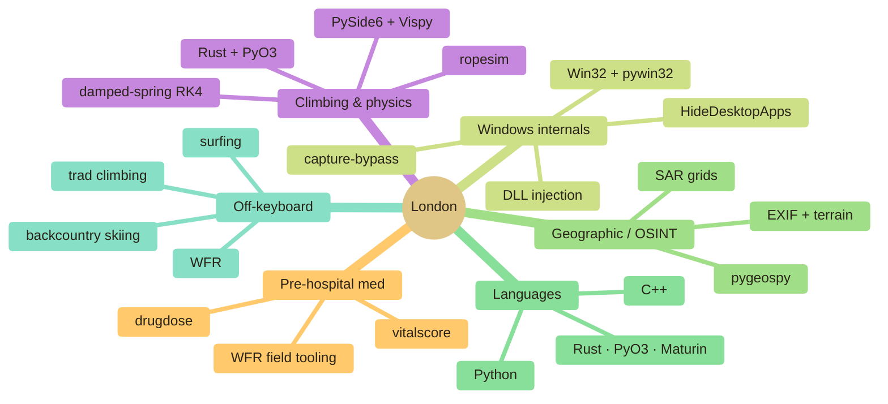

<div align="center">

[](https://git.io/typing-svg)


&nbsp;

&nbsp;


</div>

---

## 👋 &nbsp; about

California kid, freshman in college, writes Python between surf sessions and rock climbs. Half the repos here started because something annoyed me on a trail or in the field — a rope question, a pre-hospital protocol, a screen-capture API doing something I didn't ask for. So I built the tool.

I ship a lot. Half the time it's libraries, half the time it's GUIs, occasionally it's a Rust core that makes the whole thing 100× faster. I don't build for a resume — I build because the problem is interesting and I want to know how it works underneath.

> **into right now** — climbing rope dynamics · pre-hospital med tooling · Windows internals · network benchmarking · Nuke compositing
>
> **outside the keyboard** — skiing the sierras · surfing the coast · WFR field practice · climbing anywhere I can drive to

**reach me →** discord `_londo.`

---

## 🛠️ &nbsp; featured work

> Six projects I'm proudest of right now. All built end-to-end, all public.

### 👨‍💻 &nbsp; [capture-bypass](https://github.com/Londopy/capture-bypass) — Windows display-affinity tool
[](https://github.com/Londopy/capture-bypass)  [](https://github.com/Londopy/capture-bypass)

Multi-crate Cargo workspace that clears `WDA_EXCLUDEFROMCAPTURE` from Windows display-affinity flags via DLL injection. Six crates: shared injection lib, CLI, egui GUI, one-shot payload DLL, persistent payload DLL, and stress tester. GUI features live process list, auto-inject + tray mode, watch-list, global hotkey, toast notifications, injection log, update checker, and browser multi-process enumeration. 32-bit fallback for x86 targets. Ships with an Inno Setup installer.

### 🖥️ &nbsp; [HideDesktopApps](https://github.com/Londopy/HideDesktopApps) — Windows tray hotkey app
[](https://pypi.org/project/hide-desktop-apps/) [](https://github.com/Londopy/HideDesktopApps) [](https://github.com/Londopy/HideDesktopApps)

Lightweight system-tray app for streamers, presenters, focus tools, and Wallpaper Engine fans. Three configurable hotkeys (icons / taskbar / all windows), multi-monitor taskbar handling, settings GUI for hotkey rebinding + startup config, auto-start launcher, tiny memory footprint via `pystray` + `pywin32`. On PyPI as `hide-desktop-apps`.

### 💊 &nbsp; [drugdose](https://github.com/Londopy/drugdose) — EMS & clinical dosing calculator
[](https://pypi.org/project/drugdose/) [](https://github.com/Londopy/drugdose) [](https://github.com/Londopy/drugdose)

Weight-based dose calculator (mg/kg, mcg/kg, flat) with pediatric caps, IV drip-rate math (any rate unit → mL/hr pump rate + bag duration), **39 curated drug-interaction rules** with severity + management guidance, allergy + cross-reactivity matching, contraindication flags, and a 49-drug bundled database spanning EMS, cardiac, anesthesia, ICU, antibiotics, and toxicology. Pure Python, only `rich` + `click` as deps.

### 🩺 &nbsp; [vitalscore](https://github.com/Londopy/vitalscore) — Clinical scoring calculators for Python
[](https://pypi.org/project/vitalscore/) [](https://github.com/Londopy/vitalscore) [](https://github.com/Londopy/ValoTracker)

Provides typed, validated implementations of the clinical scoring tools used in emergency medicine, critical care, and pre-hospital settings — all exposed as clean Python dataclasses with interpretation strings built in.

### 🧗 &nbsp; [ropesim](https://github.com/Londopy/ValoTracker) — climbing rope physics engine
[](https://pypi.org/project/ValoTracker/) [](https://github.com/Londopy/ropesim) [](https://github.com/Londopy/ropesim/blob/main/LICENSE)

UIAA 101 / EN 892 impact-force modelling with a damped-spring RK4 integrator written in **Rust** and exposed to Python via **PyO3 / Maturin**. Ships a 20+ command CLI, a **PySide6 desktop GUI** with a 3D Vispy viewport, optional **Rapier3D** capsule-chain rope simulation, parallel batch sweeps via Rayon, a 25-rope database, and guide-mode belay device math. Built because I wanted to know what actually happens during a factor-2 fall.

### 🎮 &nbsp; [ValoTracker](https://github.com/Londopy/ValoTracker) — A fast, privacy-first Valorant match tracker written in Rust
[](https://pypi.org/project/ValoTracker/) [](https://github.com/Londopy/ValoTracker) [](https://github.com/Londopy/ValoTracker/blob/main/LICENSE)

Real-time VALORANT match tracker — view live player ranks, stats, agents, and party info.


---

## 📦 &nbsp; the stack

```bash
londo@dev:~$ env | grep STACK
```

```ini
LANGUAGES        = Python · Rust · TypeScript · C++ · Bash
BUILD_AND_SHIP   = PyPI · Maturin · PyO3 · GitHub Actions · PyInstaller · Cargo workspaces
DATA_AND_VIZ     = NumPy · Pandas · Matplotlib · Seaborn · Folium · Vispy
GUI              = PySide6 · Qt · Tkinter · pystray · pywin32
INFRA            = SQLite · Win / Linux / macOS · DLL injection · Win32
CREATIVE         = Nuke · Maya · After Effects · Premiere · AutoCAD · Houdini
```

---

## 🧭 &nbsp; how the work clusters



---

```bash
londo@dev:~$ contributions --animate
```

> Snake eats my commit graph daily. Looks better with the dark theme on.
<div align="center">


</div>

---

## 🤙 &nbsp; how I work

- Build because the problem is interesting, not for the resume.


<div align="center">

```
freshman year. just getting started.
```

</div>
