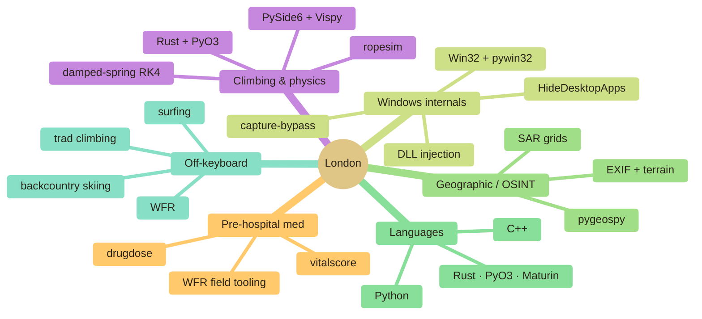

<div align="center"> 
     
[](https://git.io/typing-svg)


&nbsp;

&nbsp;


### 🌐 &nbsp; [**londopy.github.io**](https://londopy.github.io)

*the full, filterable project index — grouped by domain, with per-project writeups*

</div>

---

## 👋 &nbsp; about

I build tools for **climbing**, **medicine**, **Windows internals**, and **myself**. California kid, freshman in college, writing Python between surf sessions and rock climbs. Most of what's here started because something annoyed me on a trail or in the field — a rope question, a pre-hospital protocol, a screen-capture API doing something I didn't ask for — so I built the tool.

Rust and Python, mostly. Half of it is libraries, half is GUIs, occasionally it's a Rust core that makes the whole thing 100× faster.

> **into right now** — climbing rope dynamics · pre-hospital med tooling · Windows internals · geospatial / OSINT
>
> **outside the keyboard** — skiing the sierras · surfing the coast · WFR field practice · trad climbing anywhere I can drive to

**reach me →** discord `_londo`

---

## 🛠️ &nbsp; featured

> Four I'm proudest of. The **[full index of 18 projects across 9 domains lives on the site »](https://londopy.github.io)** — filterable by tag and language, with writeups.

### 🖥️ &nbsp; [capture-bypass](https://github.com/Londopy/capture-bypass) — Windows screen-capture bypass
[](https://github.com/Londopy/capture-bypass) [](https://github.com/Londopy/capture-bypass) [](https://londopy.github.io/projects/capture-bypass/)

DLL-injection tool that clears `WDA_EXCLUDEFROMCAPTURE` on Windows 10/11. Multi-crate workspace, egui GUI, Inno installer.

### 🧠 &nbsp; [akribia](https://github.com/Londopy/akribia) — precision-weighted Bayesian brain model
[](https://github.com/Londopy/akribia) [](https://londopy.github.io/akribia/)

Computational model of precision-weighted Bayesian inference across autism, ADHD, and PPCS — with a live in-browser demo.

### 💊 &nbsp; [drugdose](https://github.com/Londopy/drugdose) — EMS & clinical dosing calculator
[](https://pypi.org/project/drugdose/) [](https://github.com/Londopy/drugdose) [](https://londopy.github.io/projects/drugdose/)

Weight-based dosing, a 49-drug bundled database, and 39 interaction rules with severity + management guidance. Pure Python.

### 🧗 &nbsp; [ropesim](https://github.com/Londopy/ropesim) — climbing-rope physics engine
[](https://pypi.org/project/ropesim/) [](https://github.com/Londopy/ropesim) [](https://londopy.github.io/projects/ropesim/)

UIAA / EN 892 impact-force modelling — damped-spring RK4 core in Rust via PyO3 / Maturin, with a PySide6 3D GUI.

<div align="center">


</div>

---

## 📦 &nbsp; the stack

```bash
londo@dev:~$ env | grep STACK
```

```ini
LANGUAGES        = Python · Rust · TypeScript · C++ · Bash
BUILD_AND_SHIP   = PyPI · Maturin · PyO3 · GitHub Actions · PyInstaller · Cargo workspaces
DATA_AND_VIZ     = NumPy · Pandas · Matplotlib · Seaborn · Folium · Vispy
GUI              = PySide6 · Qt · Tkinter · pystray · pywin32
INFRA            = SQLite · Win / Linux / macOS · DLL injection · Win32
CREATIVE         = Nuke · Maya · After Effects · Premiere · AutoCAD · Houdini
```

---

## 🧭 &nbsp; how the work clusters




---

```bash
londo@dev:~$ contributions --animate
```

> Snake eats my commit graph daily. Looks better with the dark theme on.
<div align="center">


</div>

---

<div align="center">

```
freshman year. just getting started.
```

discord: `_londo`

</div>
