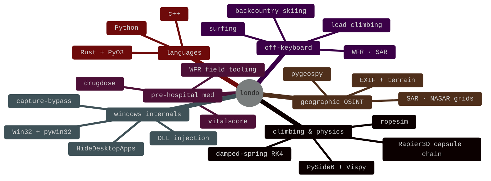

<div align="center">

[](https://git.io/typing-svg)


&nbsp;

&nbsp;


</div>

---

```bash
londo@dev:~$ cat about.md
```

California native, freshman in college, ships Python and Rust. Most of these repos started because something annoyed me on a trail, inside a Windows process, or in a pre-hospital protocol — so I wrote the tool.

I don't build for a resume. I build because the problem is interesting and I want to know how it works underneath. Half the time it's libraries, half the time it's GUIs, occasionally it's a Rust core that makes the whole thing 100× faster.

```bash
londo@dev:~$ cat status.json
```
```json
{
  "into_right_now":  ["rope dynamics", "pre-hospital med", "win32 internals", "net benchmarking"],
  "off_the_keyboard": ["climbing", "backcountry skiing", "surfing", "WFR field practice"],
  "reach":            "discord :: _Londo."
}
```

---

```bash
londo@dev:~$ ls -la ~/projects/featured/
```

#### ▸ &nbsp; [ropesim](https://github.com/Londopy/ropesim) &nbsp; — climbing rope physics engine

`python` `rust` `pyo3` `maturin` `pyside6` `vispy` `rapier3d`

[](https://pypi.org/project/ropesim/) [](https://github.com/Londopy/ropesim)

UIAA 101 / EN 892 impact-force model. Damped-spring RK4 integrator in Rust via PyO3/Maturin. Ships Python API + 20+ command CLI + PySide6 GUI with 3D Vispy viewport + optional Rapier3D capsule-chain mode. Parallel batch sweeps via Rayon. 25-rope database. Guide-mode self-locking belay device math.

#### ▸ &nbsp; [drugdose](https://github.com/Londopy/drugdose) &nbsp; — EMS & clinical drug dosing

`python` `cli` `rich` `click` `clinical` `ems`

[](https://pypi.org/project/drugdose/) [](https://github.com/Londopy/drugdose) [](https://github.com/Londopy/drugdose)

Weight-based dosing (mg/kg, mcg/kg, flat) with pediatric caps. IV drip math, any unit → mL/hr + bag duration. 39 curated drug-interaction rules with severity + management. Allergy + cross-reactivity matching. 49-drug bundled database. Pure Python.

#### ▸ &nbsp; [capture-bypass](https://github.com/Londopy/capture-bypass) &nbsp; — Windows display-affinity tool

`rust` `cargo-workspace` `dll-injection` `win32` `customtkinter`

[](https://github.com/Londopy/capture-bypass) [](https://github.com/Londopy/capture-bypass)

Multi-crate Cargo workspace. Clears `WDA_EXCLUDEFROMCAPTURE` via `OpenProcess` → `VirtualAllocEx` → `WriteProcessMemory` → `CreateRemoteThread(LoadLibraryA)`. Five crates: shared lib · CLI · optional egui GUI · one-shot payload DLL · persistent payload DLL. customtkinter Python frontend with auto-inject + x86 fallback.

#### ▸ &nbsp; [HideDesktopApps](https://github.com/Londopy/HideDesktopApps) &nbsp; — Windows tray hotkey app

`python` `pystray` `pywin32` `tray` `hotkeys`

[](https://pypi.org/project/hide-desktop-apps/) [](https://github.com/Londopy/HideDesktopApps)

Pure-Python tray app — hide/show desktop icons, taskbar, all windows via three configurable hotkeys. Multi-monitor taskbar handling. Settings GUI for hotkey rebinding + startup config. Auto-start launcher. `pystray` + `pywin32` under the hood.

---

```bash
londo@dev:~$ env | grep STACK
```

```ini
LANGUAGES        = Python · Rust · C++
BUILD_AND_SHIP   = PyPI · Maturin · PyO3 · GitHub Actions · PyInstaller · Cargo workspaces
DATA_AND_VIZ     = NumPy · Pandas · Matplotlib · Seaborn · Folium · Vispy
GUI      = PySide6 · Qt · customtkinter · pystray · pywin32
INFRA    = SQLite · Win / Linux / macOS · DLL injection · Win32
CREATIVE         = Nuke · Maya · After Effects · Houdini
```

---

```bash
londo@dev:~$ tree ~/brain
```



---


```bash
londo@dev:~$ contributions --animate
```

> Snake eats my commit graph daily. Looks better with the dark theme on.

<div align="center">


</div>

---

```bash
londo@dev:~$ cat principles.txt
```

```text
[01]  build because the problem is interesting, not for the resume
[02]  if it's hot, write it in rust — but ship the python API first
[03]  every library gets a real CHANGELOG and a real test suite
[04]  documentation is part of the deliverable, not an afterthought
```


<div align="center">

*freshman year. just getting started.*

</div>
