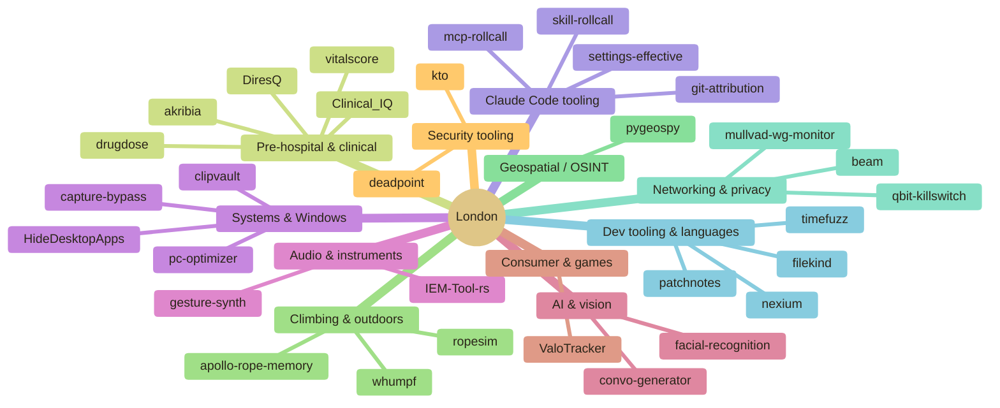

<div align="center"> 
     
[](https://git.io/typing-svg)


&nbsp;

&nbsp;

&nbsp;


### 🌐 &nbsp; [**londopy.github.io**](https://londopy.github.io)

*the full, filterable project index — grouped by domain, with per-project writeups — plus a live feed of my open-source pull requests*

</div>

---

## 👋 &nbsp; about

I build tools for **climbing**, **medicine**, **Windows internals**, and **myself**. California kid, freshman in college, writing code between surf sessions and rock climbs. Most of what's here started because something annoyed me on a trail or in the field — a rope question, a pre-hospital protocol, a screen-capture API doing something I didn't ask for — so I built the tool.

*SPRAT Level 1 rope access · WFR · NCTSN Psychological First Aid — which is why ropesim gets checked against real fall factors, drugdose came out of protocol I was already carrying on paper, and DiresQ tracks the responders instead of the incidents.*

Rust and Python, mostly. Half of it is libraries, half is GUIs, occasionally it's a Rust core that makes the whole thing 100× faster.

> **into right now** — a language of my own (nexium) · gesture-driven instruments · geospatial / OSINT · purple-team RNG analysis · climbing rope dynamics
>
> **outside the keyboard** — skiing the sierras · surfing the coast · trad climbing anywhere I can drive to

**reach me →** discord `_londo.` &nbsp;·&nbsp; irc `/msg Londopy` on `irc.libera.chat` &nbsp;·&nbsp; [send a message »](https://londopy.github.io/contact/)

<sub>on irc I stay connected, so a PM reaches me even when I'm away — no account needed, <a href="https://web.libera.chat">web.libera.chat</a> works from a browser.</sub>

---

## 🛠️ &nbsp; featured

> The pieces that show the range. The **[full index of 33 projects across 11 domains lives on the site »](https://londopy.github.io)** — filterable by tag and language, with writeups.

### 🖥️ &nbsp; [capture-bypass](https://github.com/Londopy/capture-bypass) — Windows screen-capture bypass
[](https://github.com/Londopy/capture-bypass) [](https://github.com/Londopy/capture-bypass/releases) [](https://github.com/Londopy/capture-bypass/releases/latest) [](https://github.com/Londopy/capture-bypass) [](https://github.com/Londopy/capture-bypass) [](https://londopy.github.io/projects/capture-bypass/)

Clears `WDA_EXCLUDEFROMCAPTURE` by DLL injection, so windows that opted out of screen capture show up again. Multi-crate Cargo workspace, egui GUI, Inno installer.

### ⚙️ &nbsp; [nexium](https://github.com/Londopy/nexium) — a programming language of my own
[](https://github.com/Londopy/nexium) [](https://github.com/Londopy/nexium) [](https://github.com/Londopy/nexium) [](https://londopy.github.io/projects/nexium/)

Compiles to native code through C, with automatic reference counting — no tracing collector — and a machine-checked effect system that says whether a function allocates, blocks, or can panic. One source tree ships as a C library, a Python wheel, a Rust crate, or a CLI, all from `nx ship`.

### 📝 &nbsp; [patchnotes](https://github.com/Londopy/patchnotes) — changelog parser for CI
[](https://github.com/Londopy/patchnotes) [](https://pepy.tech/project/patchnotes) [](https://pypi.org/project/patchnotes/) [](https://github.com/Londopy/patchnotes) [](https://github.com/Londopy/patchnotes) [](https://londopy.github.io/projects/patchnotes/)

Parse, query, and validate Keep a Changelog markdown and YAML — then fail the build when a release note is malformed or missing. Small, boring, and the one people actually installed.

### 🧗 &nbsp; [ropesim](https://github.com/Londopy/ropesim) — climbing-rope physics engine
[](https://pepy.tech/project/ropesim) [](https://pypi.org/project/ropesim/) [](https://pypi.org/project/ropesim/) [](https://github.com/Londopy/ropesim) [](https://londopy.github.io/projects/ropesim/)

UIAA / EN 892 impact-force modelling. Damped-spring RK4 integrator in Rust, bound to Python through PyO3 / Maturin, wrapped in a CLI and a PySide6 3D GUI — four layers, three languages, one install.

### 🚨 &nbsp; [DiresQ](https://github.com/Skythe7/DiresQ) — disaster response that tracks the responders
[](https://skythe7.github.io/DiresQ/) [](https://github.com/Skythe7/DiresQ/actions) [](https://github.com/Skythe7/DiresQ) [](https://github.com/Londopy/timefuzz) [](https://github.com/Londopy/patchnotes) [](https://londopy.github.io/projects/DiresQ/)

Every disaster app tells you where the disaster is — this one tracks the people going *into* it. Join a report, check in on a timer, and the accountability board turns red if you go dark. Reports and check-ins work offline, and the whole thing runs without JavaScript. It parses times with [timefuzz](https://github.com/Londopy/timefuzz) and validates its changelog with [patchnotes](https://github.com/Londopy/patchnotes) — two of my own libraries. Built at Katy Youth Hacks 2026 with [@Skythe7](https://github.com/Skythe7).

---

#### also worth your time

**🎲 [deadpoint](https://github.com/Londopy/deadpoint)** &nbsp;[](https://pepy.tech/project/deadpoint) [](https://pypi.org/project/deadpoint/) [](https://github.com/Londopy/deadpoint)
Purple-team RNG analysis. Detects weak PRNG usage, then *proves* it: recovers MT19937 / LCG / xorshift state with a Z3 constraint solve and predicts future and past outputs. Ends with the CSPRNG fix, not just the finding. &nbsp;[writeup »](https://londopy.github.io/projects/deadpoint/)

**⏱️ [timefuzz](https://github.com/Londopy/timefuzz)** &nbsp;[](https://pepy.tech/project/timefuzz) [](https://pypi.org/project/timefuzz/) [](https://github.com/Londopy/timefuzz)
Fuzzy natural-language time parsing. Goes where `dateparser` stops: resolves "end of Q3" or "the Tuesday after my birthday" into a datetime or range, with a confidence score so you can decide whether to trust it. &nbsp;[writeup »](https://londopy.github.io/projects/timefuzz/)

**💊 [drugdose](https://github.com/Londopy/drugdose)** &nbsp;[](https://pypi.org/project/drugdose/) [](https://github.com/Londopy/drugdose)
EMS & clinical dosing calculator. Weight-based dosing against a bundled 49-drug database, plus 39 interaction rules with severity and management guidance. Pure Python, zero runtime deps. &nbsp;[writeup »](https://londopy.github.io/projects/drugdose/)

**🪟 [HideDesktopApps](https://github.com/Londopy/HideDesktopApps)** &nbsp;[](https://github.com/Londopy/HideDesktopApps/releases/latest) [](https://github.com/Londopy/HideDesktopApps) [](https://github.com/Londopy/HideDesktopApps)
Tray daemon that hides desktop icons, taskbar, and every window on a hotkey. For ricing, Wallpaper Engine, and not flashing your desktop mid-presentation. Ships through winget *and* Scoop. &nbsp;[writeup »](https://londopy.github.io/projects/HideDesktopApps/)

**🎹 [gesture-synth](https://github.com/Londopy/gesture-synth)** &nbsp;[](https://github.com/Londopy/gesture-synth) [](https://gesture-synth.onrender.com/) [](https://github.com/Londopy/gesture-synth)
A chord instrument you play with your hands in front of a camera — MediaPipe hand-tracking drives the synth, a loop pedal layers four tracks, and the harmony is drawn back at you in 3D. One codebase spanning Rust/WASM, Svelte + Three.js, a Tauri app, a Zig DSP kernel, and a Gleam service. &nbsp;[writeup »](https://londopy.github.io/projects/gesture-synth/)

**🏔️ [whumpf](https://github.com/Londopy/whumpf)** &nbsp;[](https://github.com/Londopy/whumpf) [](https://github.com/Londopy/whumpf)
Avalanche bulletins projected onto the real mountain in 3D. Slope, aspect, and elevation are packed into RGBA tiles and filtered in a GLSL shader, so a whole range recomputes as you drag a danger slider — answering the question the bulletin doesn't: *is the slope in front of me one of those slopes?* &nbsp;[writeup »](https://londopy.github.io/projects/whumpf/)

**🗂️ [filekind](https://github.com/Londopy/filekind)** &nbsp;[](https://github.com/Londopy/filekind) [](https://github.com/Londopy/filekind)
Make a custom file extension a real, recognised file type — on Windows, Linux and macOS — from one declarative spec. Generates the registry tree, freedesktop MIME XML, macOS UTI plist, icons in three formats, and the install/remove scripts. &nbsp;[writeup »](https://londopy.github.io/projects/filekind/)

---

## 📊 &nbsp; by the numbers

<div align="center">


<sub>generated nightly into this repo — no third-party uptime to depend on</sub>

</div>

<div align="center">


</div>

---

## 📦 &nbsp; the stack

```bash
londo@dev:~$ env | grep STACK
```

<details>
<summary><b>expand the full environment »</b></summary>

<br>

```ini
LANGUAGES        = Python · Rust · TypeScript · C++ · Bash
BUILD_AND_SHIP   = PyPI · Maturin · PyO3 · GitHub Actions · PyInstaller · Cargo workspaces
                   winget · Scoop · Inno Setup
DATA_AND_VIZ     = NumPy · Pandas · Matplotlib · Seaborn · Folium · Vispy
GUI              = PySide6 · Qt · egui · Tkinter · pystray · pywin32
WEB              = Astro · Flask · TypeScript
INFRA            = SQLite · Win / Linux / macOS · DLL injection · Win32 · Z3
CREATIVE         = Nuke · Maya · After Effects · Premiere · AutoCAD · Houdini
```

</details>

---

## 🧭 &nbsp; how the work clusters

<details>
<summary><b>expand the map »</b></summary>

<br>


```mermaid
%%{init: {'theme':'base','themeVariables':{'primaryColor':'#FAF6EC','primaryTextColor':'#2A2418','primaryBorderColor':'#7A5C3A','lineColor':'#7A5C3A','tertiaryColor':'#FFF8EC'}}}%%
mindmap
  root((London))
    Systems & Windows
      capture-bypass
      HideDesktopApps
      clipvault
      pc-optimizer
    Security tooling
      kto
      deadpoint
    Pre-hospital & clinical
      drugdose
      vitalscore
      Clinical_IQ
      akribia
      DiresQ
    Climbing & outdoors
      ropesim
      whumpf
      apollo-rope-memory
    Geospatial / OSINT
      pygeospy
    Networking & privacy
      qbit-killswitch
      mullvad-wg-monitor
      beam
    Dev tooling & languages
      nexium
      patchnotes
      timefuzz
      filekind
    Claude Code tooling
      skill-rollcall
      mcp-rollcall
      settings-effective
      git-attribution
    Audio & instruments
      gesture-synth
      IEM-Tool-rs
    AI & vision
      facial-recognition
      convo-generator
    Consumer & games
      ValoTracker
```

<sub>the same domains the <a href="https://londopy.github.io">site</a> groups by — click through there to filter by tag or language</sub>

</details>

---

## 🚧 &nbsp; in progress

<details>
<summary><b>names reserved, code brewing »</b></summary>

<br>

| | | |
|---|---|---|
| `ghostwire` — networking | `barodepth` — freediving | `trailmath` — outdoors |
| `tidaltable` — outdoors | `hwsig` — systems | `memalloc` — systems |
| `procwatch` — systems | `OmniSight` — vision | |

<sub>cards appear on the <a href="https://londopy.github.io">site</a> once they ship</sub>

</details>

---

## 🌱 &nbsp; contributions

```bash
londo@dev:~$ contributions --animate
```

> Snake eats my commit graph daily. Looks better with the dark theme on.

<div align="center">


</div>

<br>

<details>
<summary><b>the same year, as a 3D sculpture »</b></summary>

<br>

<div align="center">


<sub>rebuilt nightly by <a href="https://github.com/yoshi389111/github-profile-3d-contrib">github-profile-3d-contrib</a> — nine other palettes live in <code>profile-3d-contrib/</code></sub>

</div>

</details>

---

## 🚚 &nbsp; recently shipped

<!--START_SECTION:releases-->
- **[nexium](https://github.com/Londopy/nexium)** [`v1.1.0`](https://github.com/Londopy/nexium/releases/tag/v1.1.0) — today
- **[statusmith](https://github.com/Londopy/statusmith)** [`v0.2.0`](https://github.com/Londopy/statusmith/releases/tag/v0.2.0) — today
- **[skill-rollcall](https://github.com/Londopy/skill-rollcall)** [`v1.1.0`](https://github.com/Londopy/skill-rollcall/releases/tag/v1.1.0) — yesterday
- **[gesture-synth](https://github.com/Londopy/gesture-synth)** [`v0.3.0`](https://github.com/Londopy/gesture-synth/releases/tag/v0.3.0) — 7 days ago
- **[filekind](https://github.com/Londopy/filekind)** [`v0.5.1`](https://github.com/Londopy/filekind/releases/tag/v0.5.1) — last month
- **[patchnotes](https://github.com/Londopy/patchnotes)** [`v2.6.0`](https://github.com/Londopy/patchnotes/releases/tag/v2.6.0) — last month
<!--END_SECTION:releases-->

---

<div align="center">

```
freshman year. just getting started.
```

**[londopy.github.io](https://londopy.github.io)** &nbsp;·&nbsp; discord `_londo`

</div>
